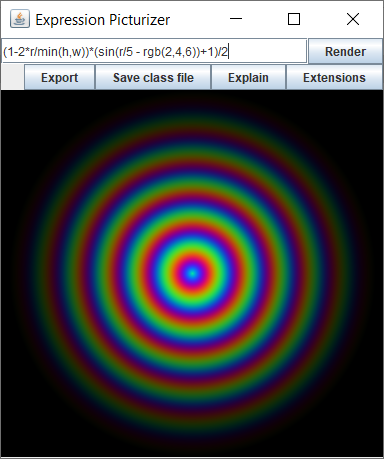
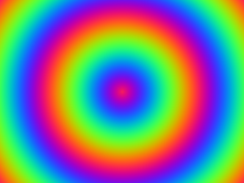
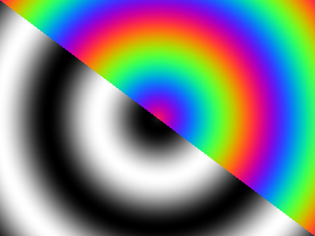

# Expression Picturizer
This program allow to render images using math expressions. It generate bytecode and use JVM for faster rendering of image.



## Build

You can build this project into self executable JAR with all dependencies inside by few commands.
1. Clone repository - `git clone https://github.com/dmitriyushakov/Expression-Picturizer.git`
2. Go to folder with repository - `cd Expression-Picturizer/`
3. Run "shadowJar" task from gradle build configuration. 
```
chmod +x gradlew
./gradlew shadowJar
```
JAR file will be located in build/libs/ directory.

## Language syntax

Expression compile to Java class. It should return double float point values in range from 0.0 to 1.0. Also it can provide different values for different color channels.

`123`, `123.45` - number constants.

`var` - variable access.

`f(x)` - function calculation.

`+`, `-`, `*`, `/` - arithmetic operators.

`>`, `<`, `==`, `!=`, `>=`, `<=` - compare operators.

`not <expr>`, `<expr1> and <expr2>`, `<expr1> or <expr2>` - boolean logic operators.

`(`, `)` - brackets (for change operators priority).

## Functions

Program have some count of registered functions (look [java.lang.Math javadoc](https://docs.oracle.com/javase/8/docs/api/java/lang/Math.html) for details).

`max(a,b)` - return maximum of two values.

`min(a,b)` - return minimum of two values.

`sin(x)` - returns the trigonometric sine of an angle.

`cos(x)` - returns the trigonometric cosine of an angle.

`tan(x)` - returns the trigonometric tangent of an angle.

`asin(x)` - returns the trigonometric arc sine of an angle.

`acos(x)` - returns the trigonometric arc cosine of an angle.

`atan(x)` - returns the arc tangent of a value.

`atan2(x)` - returns the angle theta from the conversion of rectangular coordinates (x, y) to polar coordinates (r, theta).

`pow(a,b)` - returns the value of the first argument raised to the power of the second argument.

`abs(x)` - returns the absolute value.

`sinh(x)` - returns the hyperbolic sine of a value.

`cosh(x)` - returns the hyperbolic cosine of a value.

`tanh(x)` - returns the hyperbolic tangent of a value.

`sqrt(x)` - returns the correctly rounded positive square root of a double value.

`floor(x)` - returns the largest (closest to positive infinity) double value that is less than or equal to the argument and is equal to a mathematical integer.

`ceil(x)` - returns the smallest (closest to negative infinity) double value that is greater than or equal to the argument and is equal to a mathematical integer.

`log(a)` - Returns the natural logarithm (base e) of a value

`log10(a)` - Returns the base 10 logarithm of a value.

`exp(a)` - Returns Euler's number e raised to the power of a double value.

`rgb(red,green,blue)` - split expression for red, green and blue channels. In fact this function not assigned to any Java methods it just allow to split expression to 3 separated.

## Variables

`pi` - The double value that is closer than any other to pi, the ratio of the circumference of a circle to its diameter.

`e` - The double value that is closer than any other to e, the base of the natural logarithms.

`x` - x coordinate which means distance from left side of the picture.

`y` - y coordinate which means distance from top side of the picture.

`a` - angle between point and top center point in center of picture. Could be calculated as `atan2(x-w/2,y-h/2)`.

`r` - distance from center of the picture to this point in pixels.

`w` - picture width.

`h` - picture height.

`t` - time variable. If present in expression, program will update picture in loop with different `t` value. It change with speed 1 per second.

`red` - boolean const which true only for red channel.

`green` - boolean const which true only for green channel.

`blue` - boolean const which true only for blue channel.

## Examples

`x>y*w/h`


`(x+y)/(w+h)`


`red * (x+y)/(w+h)`


`(sin(r/20)+1)/2`


`(sin(r/20 + rgb(2,4,6))+1)/2`


`(sin(r/20 + (x<y*w/h ? 4 : rgb(2,4,6)))+1)/2`
